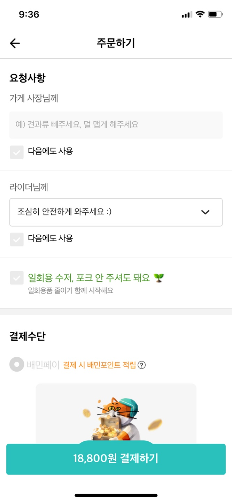
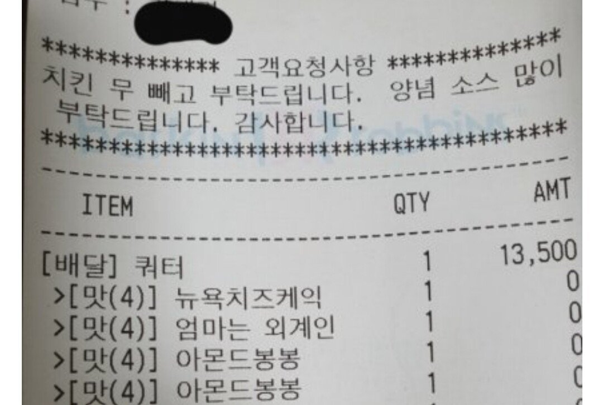

## UI_UX

### 210314_배달의민족 _주문 요청사항

- ASIS: 요청사항 하단에 '다음에도 사용' 체크박스가 있어서 사용자가 적은 요청사항을 다음 주문에도 사용 가능함
  
- 문제상황: 가게ID와 상관없이 요청사항은 그대로 남아 있어, 전혀 상관없는 요청사항이 기록되어 있거나, 주문내용에 따라 결국 요청사항을 새로 작성해야 하는 상황이 생김 😂
  
- 개선방법:
  - 가게 ID별 요청사항이 저장되도록 데이터 저장 구조 및 프로세스 변경 필요 -> 가게ID별 요청사항이 저장되는 프로세스의 경우 저장되는 데이터의 양이 기하급수적으로 늘어날 가능성이 있음. 결국 디비 사용량 증가의 문제가 발생함.
  - 최신순 또는 사용량순으로 최대 5개 정도의 요청사항을 저장하는 방법 -> 모든 요청사항을 저장하지 못한다는 측면에서 사용자 편의성이 떨어질 수 있음. 또한 최신순 또는 사용량순으로 정렬 또는 계산작업이 들어가면 결국 디비성능 저하를 초래할 수 있음.
